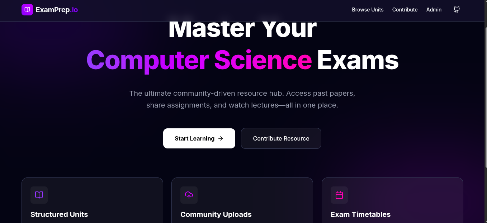
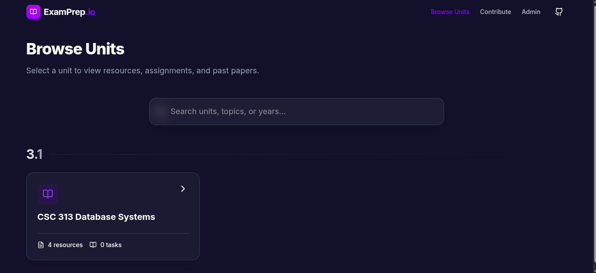
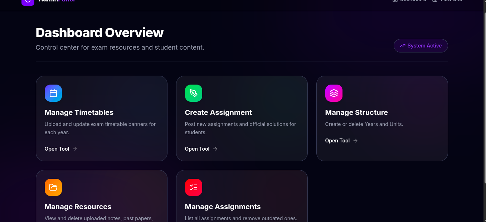
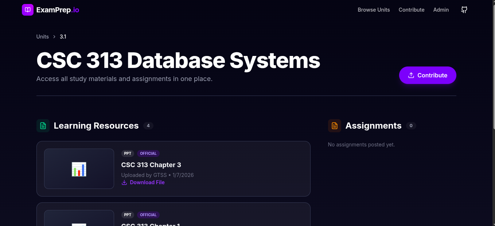

# 🎓 GTSS Exam Prep Portal


> **The official academic resource hub for Computer Science students.**  
> Access past papers, lecture notes, assignments, and verified solutions in a premium, student-focused interface.

🔗 **Live Demo:** [https://studentsexamprepportalmu-24cs.vercel.app](https://studentsexamprepportalmu-24cs.vercel.app)

---

## 🚀 Key Features

### 📚 Resource Management
*   **Structured Content**: Organize materials by **Year** and **Unit**.
*   **Rich Media Support**: Upload PDFs, DOCX, ZIPs, or embed **YouTube** videos directly.
*   **Official vs. Community**: Clearly distinguish between official lecturer uploads and student contributions.

### 📝 Assignments & Solutions
*   **Task Hub**: View specific assignments for each unit.
*   **Solution Sharing**: Submit your own solutions or view official answer keys.
*   **Attribution**: Contributors get recognized with "Uploaded by {Name}" badges.

### 🛡️ Admin Dashboard (Protected)
*   **Secure Access**: Protected by **NextAuth** credentials (contact admin for access).
*   **CMS Capabilities**: Create years, units, and manage all content from a premium dashboard.
*   **Timetable Manager**: Update exam banners dynamically for each year group.

---

## 🛠️ Tech Stack

Built with the latest Modern Web Technologies for speed, scale, and aesthetics.

*   **Framework**: [Next.js 15 (App Router)](https://nextjs.org/)
*   **Language**: [TypeScript](https://www.typescriptlang.org/)
*   **Styling**: [Tailwind CSS](https://tailwindcss.com/) + [Framer Motion](https://www.framer.com/motion/) (Animations)
*   **Database**: [PostgreSQL (Prisma ORM)](https://www.prisma.io/)
*   **Storage**: [Vercel Blob](https://vercel.com/docs/storage/vercel-blob) (Files) + [Cloudinary](https://cloudinary.com/) (Images)
*   **Auth**: [NextAuth.js](https://next-auth.js.org/)
*   **Icons**: [Lucide React](https://lucide.dev/)

---

## 📸 Screenshots

| Landing Page | Unit Details |
|:---:|:---:|
|  |  |

| Admin Dashboard | Dark Mode UI |
|:---:|:---:|
|  |  |

---

## ⚡ Getting Started

### Prerequisites
*   Node.js 18+
*   PostgreSQL Database
*   Vercel Blob Token

### Installation

1.  **Clone the repository**
    ```bash
    git clone https://github.com/your-username/studentsexamprepportal.git
    cd studentsexamprepportal
    ```

2.  **Install dependencies**
    ```bash
    npm install
    ```

3.  **Setup Environment Variables**
    Create a `.env` file:
    ```env
    DATABASE_URL="postgresql://..."
    BLOB_READ_WRITE_TOKEN="vercel_blob_..."
    NEXTAUTH_SECRET="your_secret"
    NEXTAUTH_URL="http://localhost:3000"
    ```

4.  **Run Database Migrations**
    ```bash
    npx prisma db push
    ```

5.  **Start Development Server**
    ```bash
    npm run dev
    ```

---

## 🤝 Contributing

We welcome contributions from the GTSS community! If you have a feature request or bug report, please open an issue or submit a PR.

**License**: MIT
**Maintained by**: Elvin & GTSS Tech Team
